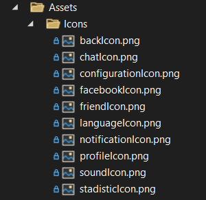

= UNIVERSIDAD VERACRUZANA
LIC. INGENIERÍA DE SOFTWARE
FACULTAD DE ESTADÍSTICA E INFORMÁTICA
:doctype: report
:toc: left
:toclevels: 3

== TECNOLOGÍAS PARA LA CONSTRUCCIÓN DE SOFTWARE

=== ACTIVIDAD: Entrega semanal de avances

*Realizado por:*  
Rodrigo Iván Ahumada Rodríguez (S21013886)  
Marquez Rodríguez Seth (S23014042)

*Docente:*  
Perez Arriaga Juan Carlos  

*Fecha de entrega:*  
Xalapa, Ver., 26 de septiembre de 2025

== Primer reporte de Avance del proyecto final: Juego Damas Chinas

=== Recursos implementados

. **Recurso de idiomas (Lang)**  
Se implementó internacionalización estática para inglés y español, lo que permite mostrar textos de la interfaz en ambos idiomas.

image::images/Lang_Rute.png[Ruta Lang , width=300]

image::images/Lang_Resource.png[Recurso Lang , width=300]

. **Carpeta Assets/Icons**  
Contiene los íconos para elementos gráficos de la interfaz, como chat, perfil, notificaciones, sonido, idioma, estadísticas, etc.

. **Utilidades**  
Contiene utilidades generales que serán implementadas a lo largo del código facilitando la reutilización y estandarización.  

.. *Correo*: módulo para facilitar el envío de correos.  

image::images/Mail_Code.png[Utilidades Correo, width=300]

.. *Hasher.cs*: encriptación de contraseñas con BCrypt.  

image::images/Hasher_Code.png[Utilidades Correo sender, width=300]

.. *Validator.cs*: utilidades de validación general.  

... Correo

... Password

... Usuario

---

=== Ventanas desarrolladas

. *Login.xaml*  
Funcionalidad: Permite el acceso al sistema para usuarios registrados.  
Características: Validación de correo y contraseña con BCrypt.  
Internacionalización: Inglés y español.  
Estado: Funcional.

image::images/Window_Login_Spanish.png[Login Español, width=300]  
image::images/Window_Login_English.png[Login Inglés, width=300]

. *SignIn.xaml*  
Funcionalidad: Registro de nuevos usuarios.  
Características: Validación de correo y contraseñas seguras. Notificación por correo en Gmail.  
Internacionalización: Inglés y español.  
Estado: Funcional.

image::images/Window_SignIn_Spanish.png[Registro Español, width=300]  

. *MainMenuRegisteredPlayer.xaml*  
Menú principal para usuarios registrados (partidas, amigos, perfil, configuración, chat y estadísticas).  
Internacionalización: Inglés y español.

image::images/Window_MainMenuRegisteredPlayer_Spanish.png[Menú Registrado Español, width=300]  

. *MainMenuGuestPlayer.xaml*  
Menú principal simplificado para invitados. Acceso limitado a partidas y opciones básicas.  

  
image::images/Window_MainMenuGuestPlayer_English.png[Menú Invitado Inglés, width=300]

. *PlayerProfile.xaml*  
Vista de perfil con estadísticas, logros e información del usuario.  

image::images/Window_PlayerProfile_Spanish.png[Perfil Jugador Español, width=300]  

. *GuestProfile.xaml*  
Perfil básico para invitados (nombre temporal, avatar por defecto).  

  
image::images/Window_GuestProfile_English.png[Perfil Invitado Inglés, width=300]

. *FriendsList.xaml*  
Lista de amigos: agregar, eliminar, estados de conexión, mensajes.  
Estado: En construcción.  

image::images/Window_FriendsList_Spanish.png[Lista Amigos Español, width=300]  
image::images/Wnidow_FriendsList_English.png[Lista Amigos Inglés, width=300]

. *ChatWindow.xaml*  
Ventana de chat entre jugadores.  
Estado: En construcción.  

image::images/Window_ChatWindow_Spanish.png[Chat Español, width=300]  
image::images/Window_ChatWindow_English.png[Chat Inglés, width=300]

. *SelectLanguage.xaml*  
Selección de idioma (inglés/español, carga de diccionarios Lang).  
Estado: Funcional.  

image::images/Window_SelectLanguage_Spanish.png[Selección Idioma Español, width=300]  
image::images/Window_SelectLanguage_English.png[Selección Idioma Inglés, width=300]

. *MainWindow.xaml*  
Ventana base del proyecto en WPF. Punto de arranque de la aplicación.  

  
image::images/Window_MainWindow_English.png[Ventana Principal Inglés, width=300]

---

=== Mapeo de Base de Datos con Entity Framework

Se creó la base de datos en SQL Server Management Studio y se conectó en Visual Studio usando Entity Framework.  
Se comprobó la conexión correcta mediante autenticación en SQL Server.  

image::images/xxx.png[Entity Mapeo, width=300]

---

=== Resumen de contribución por integrante

*Integrante 1 – Rodrigo Iván Ahumada Rodríguez*  
- Diseño e implementación de vistas.  
- Creación e integración de íconos.  
- Configuración de la conexión a BD.  
- Internacionalización (50%).  
Contribución estimada: 60%.  

*Integrante 2 – Marquez Rodríguez Seth*  
- Desarrollo de la navegabilidad entre ventanas.  
- Implementación de la BD en SQL Server.  
- Implementación de utilidades: validación, encriptación, validadores.  
- Internacionalización (50%).  
Contribución estimada: 60%.  

*Nota:* El equipo considera que ambas contribuciones son complementarias (uno enfocado en capa visual y BD, el otro en lógica de validación y soporte multilenguaje).

== Uso de Inteligencia Artificial (IA)

El equipo definió reglas para un uso responsable:  

* Permitido: consultar sobre tecnologías y ventajas.  
* Permitido: ejemplos generales de implementación.  
* No permitido: pedir desarrollo completo de módulos.  
* Permitido: compartir código propio para revisión y comentarios.  
* Prohibido: usar código generado por IA que no se entienda.  

---