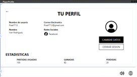
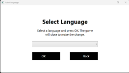
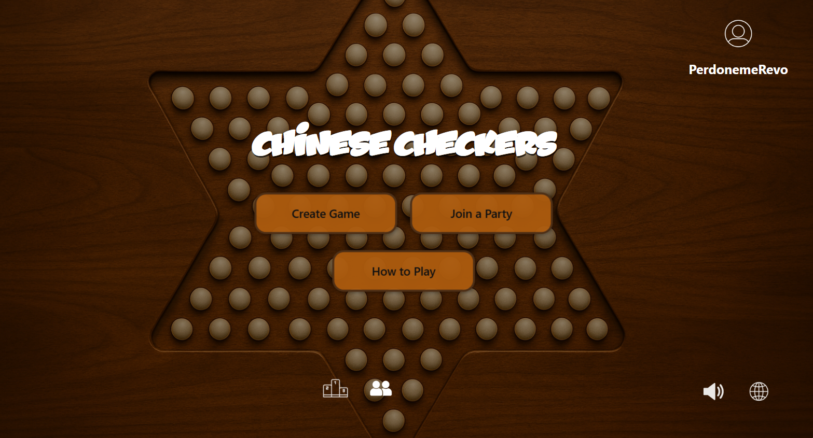

= UNIVERSIDAD VERACRUZANA
LIC. INGENIERÍA DE SOFTWARE
FACULTAD DE ESTADÍSTICA E INFORMÁTICA
:doctype: report
:toc: left
:toclevels: 3

== TECNOLOGÍAS PARA LA CONSTRUCCIÓN DE SOFTWARE

=== ACTIVIDAD: Entrega semanal de avances

*Realizado por:*  
Rodrigo Iván Ahumada Rodríguez (S21013886)  
Marquez Rodríguez Seth (S23014042)

*Docente:*  
Perez Arriaga Juan Carlos  

*Fecha de entrega:*  
Xalapa, Ver., 26 de septiembre de 2025

== Primer reporte de Avance del proyecto final: Juego Damas Chinas

=== Recursos implementados

. **Recurso de idiomas (Lang)**  
Se implementó internacionalización estática para inglés y español, lo que permite mostrar textos de la interfaz en ambos idiomas.

. **Carpeta Assets/Icons**  
Contiene los íconos para elementos gráficos de la interfaz, como chat, perfil, notificaciones, sonido, idioma, estadísticas, etc.

image::images/Assets_Rute.png[Recurso Assets , width=300]

. **Utilidades**  
Contiene utilidades generales que serán implementadas a lo largo del código facilitando la reutilización y estandarización.  

image::images/Validator_Rute.png[Utilidades, width=300]

.. *Correo*: módulo para facilitar el envío de correos.  

.. *Hasher.cs*: encriptación de contraseñas con BCrypt.  

.. *Validator.cs*: utilidades de validación general.  

... Correo

image::images/Validator_Mail_Code.png[Validar correo, width_300]

... Password

image:images/Validator_Password_Code.png[Validar Password, width_300]

... Usuario

image:images/Validator_User_Code.png[Validar Password, width_300]

---

=== Ventanas desarrolladas

. *Login.xaml*  
Funcionalidad: Permite el acceso al sistema para usuarios registrados.  
Características: Validación de correo y contraseña con BCrypt.  
Internacionalización: Inglés y español.  
Estado: Funcional.

  

. *SignIn.xaml*  
Funcionalidad: Registro de nuevos usuarios.  
Características: Validación de correo y contraseñas seguras. Notificación por correo en Gmail.  
Internacionalización: Inglés y español.  
Estado: Funcional.

  
image::images/Window_SignIn_English.png[Registro Inglés, width=300]
image::images/Example_Correo_Registro.png[Ejemplo Correo registro, width=300]

. *MainMenuRegisteredPlayer.xaml*  
Menú principal para usuarios registrados (partidas, amigos, perfil, configuración, chat y estadísticas).  
Internacionalización: Inglés y español.

  
image::images/Window_MainMenuRegisteredPlayer_English.png[Menú Registrado Inglés, width=300]

. *MainMenuGuestPlayer.xaml*  
Menú principal simplificado para invitados. Acceso limitado a partidas y opciones básicas.  

image::images/Window_MainMenuGuestPlayer_Spanish.png[Menú Invitado Español, width=300]  
image::images/Window_MainMenuGuestPlayer_English.png[Menú Invitado Inglés, width=300]

. *PlayerProfile.xaml*  
Vista de perfil con estadísticas, logros e información del usuario.  

  
image::images/Window_PlayerProfile_English.png[Perfil Jugador Inglés, width=300]

. *GuestProfile.xaml*  
Perfil básico para invitados (nombre temporal, avatar por defecto).  

image::images/Window_GuestProfile_Spanish.png[Perfil Invitado Español, width=300]  

. *FriendsList.xaml*  
Lista de amigos: agregar, eliminar, estados de conexión, mensajes.  
Estado: En construcción.  

image::images/Window_FriendsList_Spanish.png[Lista Amigos Español, width=300]  

. *ChatWindow.xaml*  
Ventana de chat entre jugadores.  
Estado: En construcción.  

  
image::images/Window_ChatWindow_English.png[Chat Inglés, width=300]

. *SelectLanguage.xaml*  
Selección de idioma (inglés/español, carga de diccionarios Lang).  
Estado: Funcional.  

  

. *MainWindow.xaml*  
Ventana base del proyecto en WPF. Punto de arranque de la aplicación.  

image::images/Window_MainWindow_Spanish.png[Ventana Principal Español, width=300]  

---

=== Mapeo de Base de Datos con Entity Framework

Se creó la base de datos en SQL Server Management Studio y se conectó en Visual Studio usando Entity Framework.  
Se comprobó la conexión correcta mediante autenticación en SQL Server.  

image::images/xxx.png[Entity Mapeo, width=300]

---

=== Resumen de contribución por integrante

*Integrante 1 – Rodrigo Iván Ahumada Rodríguez*  
- Diseño e implementación de vistas.  
- Creación e integración de íconos.  
- Configuración de la conexión a BD.  
- Internacionalización (50%).  
Contribución estimada: 50%.  

*Integrante 2 – Marquez Rodríguez Seth*  
- Desarrollo de la navegabilidad entre ventanas.  
- Implementación de la BD en SQL Server.  
- Implementación de utilidades: validación, encriptación, validadores.  
- Internacionalización (50%).  
Contribución estimada: 50%.  

*Nota:* El equipo considera que ambas contribuciones son complementarias (uno enfocado en capa visual y BD, el otro en lógica de validación y soporte multilenguaje).

== Uso de Inteligencia Artificial (IA)

El equipo definió reglas para un uso responsable:  

* Permitido: consultar sobre tecnologías y ventajas.  
* Permitido: ejemplos generales de implementación.  
* No permitido: pedir desarrollo completo de módulos.  
* Permitido: compartir código propio para revisión y comentarios.  
* Prohibido: usar código generado por IA que no se entienda.  

---

== Segundo reporte de Avance del proyecto final: Juego Damas Chinas

== Server

=== AccountManager.cs

==== DataContracts
- **PublicProfile**
    - Representa la información pública de un usuario.
    - Campos:
        - **`Username`** (string) – nombre de usuario del perfil.
        - **`Nombre`** (string) – nombre propio del usuario.
        - **`LastName`** (string) – apellido del usuario.
        - **`Correo`** (string) – correo del usuario.
        - **`Telefono`** (string) – teléfono registrado del usuario.

- **UsuarioInfo**
    - Representa la información de un usuario dentro de una operación.
    - Campos:
        - **`IdUsuario`** (int) – identificador del usuario.
        - **`Username`** (string) – nombre de usuario.
        - **`Correo`** (string) – correo del usuario.
        - **`NombreCompleto`** (string) – concatenación de nombre y apellido.

- **ResultadoOperacion**
    - Representa el resultado de una operación de modificación de datos.
    - Campos:
        - **`Exito`** (bool) – indica si la operación fue exitosa.
        - **`Mensaje`** (string) – descripción del resultado.
        - **`Usuario`** (UsuarioInfo) – información del usuario afectado (opcional, puede ser null).

==== Servicios
- **IAccountManager** (ServiceContract)
    - Define las operaciones expuestas por el servicio WCF **AccountManager**.
    - Operaciones (OperationContract):
        - **`PublicProfile ObtenerPerfilPublico(int idUsuario)`**
        - **`ResultadoOperacion CambiarUsername(int idUsuario, string nuevoUsername)`**
        - **`ResultadoOperacion CambiarPassword(int idUsuario, string nuevaPassword)`**

==== Operaciones / Funcionalidad
1. **ObtenerPerfilPublico(int idUsuario)**
   - Función: Devuelve la información pública de un usuario.
               Internamente delega la obtención a **RepositorioUsuarios.ObtenerPerfilPublico**.
   - Retorna: **PublicProfile** (DataContract)
   - Retorna **null** si el usuario no existe.

2. **CambiarUsername(int idUsuario, string nuevoUsername)**
   - Función: Modifica el nombre de usuario de un usuario.
               Delegado a **RepositorioUsuarios.CambiarUsername**, que valida el username.
   - Retorna: **ResultadoOperacion** (DataContract)
       - **`Exito`**, **`Mensaje`**, **`Usuario`** (actualmente null)

3. **CambiarPassword(int idUsuario, string nuevaPassword)**
   - Función: Modifica la contraseña de un usuario.
               Delegado a **RepositorioUsuarios.CambiarPassword**, que valida la contraseña.
   - Retorna: **ResultadoOperacion** (DataContract)
       - **`Exito`**, **`Mensaje`**, **`Usuario`** (actualmente null)

=== LoginService.cs

==== DataContracts
- **LoginResult**
    - Representa el resultado de la validación de login de un usuario.
    - Campos:
        - **`IdUsuario`** (int) – identificador del usuario.
        - **`Username`** (string) – nombre de usuario del perfil.
        - **`Success`** (bool) – indica si la validación fue exitosa.

==== Servicios
- **ILoginService** (ServiceContract)
    - Define las operaciones expuestas por el servicio WCF **LoginService**.
    - Operaciones (OperationContract):
        - **`LoginResult ValidarLogin(string usuarioInput, string password)`**

==== Operaciones / Funcionalidad
1. **ValidarLogin(string usuarioInput, string password)**
   - Función: Valida las credenciales de un usuario.
               Internamente delega la operación a **RepositorioUsuarios.ObtenerLoginResult**.
   - Retorna: **LoginResult** (DataContract)
       - **`IdUsuario`**, **`Username`**, **`Success`**
   - Validación mínima: Se asegura de que los parámetros no estén vacíos dentro del repositorio.

=== SingInService.cs

==== DataContracts
- **UsuarioInfo**
    - Representa la información de un usuario dentro de una operación.
    - Campos:
        - **`IdUsuario`** (int) – identificador del usuario.
        - **`Username`** (string) – nombre de usuario.
        - **`Correo`** (string) – correo del usuario.
        - **`NombreCompleto`** (string) – concatenación de nombre y apellido.

- **ResultadoOperacion**
    - Representa el resultado de una operación sobre datos de usuario.
    - Campos:
        - **`Exito`** (bool) – indica si la operación fue exitosa.
        - **`Mensaje`** (string) – descripción del resultado o error.
        - **`Usuario`** (UsuarioInfo) – información del usuario afectado (opcional, puede ser null).

==== Servicios
- **ISingInService** (ServiceContract)
    - Define las operaciones expuestas por el servicio WCF **SingInService**.
    - Operaciones (OperationContract):
        - **`ResultadoOperacion CrearUsuario(string nombre, string apellido, string correo, string password, string username)`**

==== Operaciones / Funcionalidad
1. **CrearUsuario(string nombre, string apellido, string correo, string password, string username)**
   - Función: Crea un nuevo usuario junto con su perfil asociado.
               Internamente delega la operación a **RepositorioUsuarios.CrearUsuario**, 
               que realiza todas las validaciones de nombre, apellido, correo, username y contraseña.
   - Retorna: **ResultadoOperacion** (DataContract)
       - **`Exito`** – true si se creó correctamente.
       - **`Mensaje`** – mensaje de éxito o error.
       - **`Usuario`** – **UsuarioInfo** con los datos del usuario creado.
   - Envío de correo de bienvenida: Opcionalmente envía un email en segundo plano tras la creación del usuario.
   - Validación: Todas las validaciones se realizan en **RepositorioUsuarios**, no en el servicio.

=== Logica

==== RepositorioUsuarios.cs 

1. **CrearUsuario(string nombre, string apellido, string correo, string password, string username)**
   - Función: Crea un nuevo usuario junto con su perfil asociado en la base de datos.
               Antes de guardar, valida los datos usando la clase **Validator**:
                 - Nombre y apellido → **Validator.ValidarNombre**
                 - Correo → **Validator.ValidarCorreo**
                 - Username → **Validator.ValidarUsername**
                 - Contraseña → **Validator.ValidarPassword**
   - Retorna: usuarios (entidad creada con su perfil agregado).
   - Excepciones: Lanza excepción si ya existe el correo o el username, 
                  o si algún dato no cumple las reglas de validación.

2. **ObtenerLoginResult(string usuarioInput, string password)**
   - Función: Valida las credenciales de un usuario y retorna información básica para login.
               Realiza validación mínima de que los parámetros no estén vacíos.
   - Retorna: **LoginResult**
     - **`IdUsuario`**, **`Username`**, **`Success`**
   - Excepciones: Lanza excepción si **usuarioInput** o **password** están vacíos.

3. **ObtenerPerfilPublico(int idUsuario)**
   - Función: Obtiene la información pública de un usuario a partir de su id.
   - Retorna: **PublicProfile** (datos como username, nombre, apellido, correo y teléfono).
   - Retorna **null** si el usuario no existe.

4. **CambiarUsername(int idUsuario, string nuevoUsername)**
   - Función: Actualiza el nombre de usuario de un perfil.
               Antes de modificarlo, valida el username usando:
                 - **Validator.ValidarUsername**
   - Retorna: **bool** – `true` si la operación fue exitosa.
   - Excepciones: Lanza excepción si el username ya existe, el perfil no se encuentra, 
                  o el username no cumple las reglas de validación.

5. **CambiarPassword(int idUsuario, string nuevaPassword)**
   - Función: Actualiza la contraseña de un usuario.
               Antes de modificarla, valida la contraseña usando:
                 - **Validator.ValidarPassword**
   - Retorna: **bool** – `true` si la operación fue exitosa.
   - Excepciones: Lanza excepción si el usuario no existe o la contraseña no cumple las reglas de validación.

=== IMPLEMENTACION

=== SingIn

image::images/SingInUi/Base.png[Directorio server, width=600]

image::images/SingInUi/BaseErrorContraseñaInsegura.png[Directorio server, width=600]

image::images/SingInUi/BaseExito.png[Directorio, width=600]

=== MenuRegisteredPlayer

=== ProfilePlayer

=== ChangeData

image::images/ChangeData/BaseExitoContraseña.png[Directorio, width=600]

==== Evidencia posterior al cambio

== DOCUMENTACION 

Elaboración de un documento de **AsciiDoc** para facilitar el control y registro de los cambios realizados con cada entrega.

== Avance del Proyecto Final: Juego Damas Chinas (Entrega 2)

=== SETH
- **Creación del server:** 100%
- **Implementación de servicios en el cliente:** 100%
- **Creación de documento ASCII-DOC:** 60%
- **Conexión de Cliente con Host:** 100%

=== IVAN
- **GUI:** 100%

== Tercer reporte de entrega

=== Modificaciones a la BD

En busqueda de mantener la persistencia de los mensajes existentes en un chat de amigos se implemento la siguiente tabla en la base de datos, con la finalidad de no saturar la memoria del servidor para acceder a las platicas.

=== Cliente

==== CHAT

Funcionalidad: Guardar Mensajes entre amigos.  
Características: Muestra de forma dinamica la recepcion de mensajes manteninedo chats individuales entre amigos. 
Internacionalización: Inglés y español.  
Estado: En proceso, la mensajeria funciona pero el callback que actualiza al llegar un nuevo mensaje aun no esta del todo funcional

**Fucionalidad**

AL iniciar la ventana de chat, se recurre a la interfaz *MesageService* misma que se encarga de consultar los mensajes existentes entre 2 usuarios y agregarlos a una coleccion de mensajes misma que sera mostrada automaticamente por la page.

==== Friends

Funcionalidad:

- Mostrar la lista de amigos  
- Permite la apertura de un chat con amigos
- Nos permite consultar el perfil publico de nuestros amigos

Características: Al entrar en la ventana se recupera la lista de amigos del usuario y los despliega por medio de una lista de amigos provista por el servidor

Y lo muestra por medio de un  ItemControl Para mantener la estetica de nuestras ventanas y permiten la creacion de botones dinamicos para cada uno de los amigos.

=== Servidor

**Evidencia Servicios Corriendo**

==== AmistadService

*Funcionalidades y estado.*

Este servicio es el encargado de todo lo relacionado a la gestion de amigos.

- Mostrar Lista de Amigos (Funcional)
- Agregar amigo (pendiente de implementacion)
- Eliminar amigo (pendiente de implementacion)
- Bloquear usuario (pendiente de implementacion)

==== MessageService

Este servicio es el encargado de todo lo relacionado a la entrega de mensajes entre amigos para el chat

**DTO**

**ServiceContract**

image::images/Server/MensajeriaService/ServiceContract.png[ ServiceContract , width=600]

**Service**

image::images/Server/MensajeriaService/service.png[ ServiceContract , width=600]

**UtilidadesImplementadas**

encargadas de mediar la logica entre el servidor y la implementacion de entity framework 

== Avance del Proyecto Final: Juego Damas Chinas (Entrega 3)

=== SETH
- **Creacion e implementacion de el servicio de mensajes:** 100%
- **Creacion del servicio de amigos** 100%
- **Creacion del servicio de mensajes** 100%
- **Creación de documento ASCII-DOC:** 50%
- **Implemtacion de servicio amigos en cliente** 100%
- **Implementacion de servicio de mensajes en cliente* 100%
- **Modificacion de la base de datos** 50%

=== IVAN
- **GUI:** 100%
